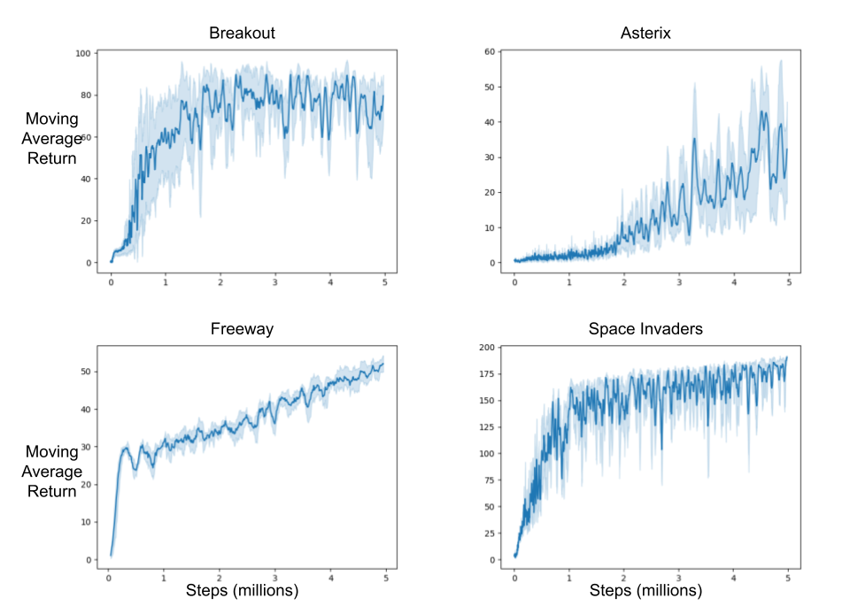

# DreamerV2 JAX
An implementation of DreamerV2 written in JAX. When the environment itself is written in JAX this implementation can compile the agent environment interaction loop to run entirely on GPU. This implementation is based on my earlier DreamerV2 implementation available at https://github.com/kenjyoung/dreamerv2, but aims to be cleaner and more modular and includes several additional features. In particular, this version:
* Supports JIT compiling the agent-environment interaction loop for environments written in JAX.
* Also supports non-JAX environments with minimal special handling.
* For JAX environments, supports running the same experiment with multiple random seeds on a single GPU using the dreamer_multiseed.py script.
* Supports saving and restarting checkpoints in case training is interrupted or one simply wishes to run for more steps.
* Uses wandb for tracking experiments.

Additionally, in this implementation reward and termination are predicted for the *next* time-step rather than the current time-step (as was done in my previous implementation), which probably makes more sense. Results are presented for the [gymnax](https://github.com/RobertTLange/gymnax) implementations of the MinAtar games.

## Usage
This repo uses JAX, Haiku, NumPy, gymnax, gym, and wandb. 

A new training run with a single random seed can be performed with a command like the following:
```bash
python3 dreamer_single_seed.py -c config.json -s 0
```
Available argument flags are:

-c specifies the configuration file, an example of which is provided in config.json.<br>
-s specifies the random seed. Default is 0.<br>
-o specifies where to save the output data. Default is "dreamer.out".<br>
-g specifies the "group" of the run for wandb, which helps to organize multiple repeats of the same experiment.<br>
--load_checkpoint specifies a file containing a previously saved checkpoint to continue from. If the file does not exist the script will still run but print a warning.<br>
--save_checkpoint specifies where to save the checkpoint file for this run. Default is checkpoint.pkl.<br>

Only the -c flag is mandatory, however, it's important to realize the random seed defaults to 0. If one wants to run multiple random repeats of the same experiment it's important to manually specify different seeds for each. This script can be used with environments that are written in JAX as well as those that are not (this is indicated by setting the `jax_env` variable in the config file).

A new training run with multiple random seeds on a single GPU can be performed with a command like the following:
```bash
python3 dreamer_multiseed.py -c config.json -s 0
```
The available arguments are the same. The number of random seeds to run is specified by `num_seeds` in the config file, each seed will be treated as a separate run by wandb. This script requires the environment to be written in JAX, and the `jax_env` variable in the config file should be set to `true`.

## Implementation Overview
A key feature of this implementation is that the entire state of an experiment (model parameters, environment state, random seed etc.) is stored in a single JAX-compatible Pytree which makes it straightforward to vmap the entire state to run multiple experiments in parallel on a single GPU. This works as long as the environment itself is written in JAX. 

The code for running the agent environment interaction loop is found in agent_environment_interaction_loop.py. That file contains `get_agent_environment_interaction_loop_function`, which takes a variable `F` containing a bunch of functions used by the interaction loop (including loss functions, functions for manipulating the replay buffer, etc.) as well as the desired number of `iterations` to execute in each call and a `config` containing the experiment configuration. This function itself returns an `agent_environment_interaction_loop_function` which takes a `run_state` `S`, runs a number of iterations of agent environment interaction, including training, and then returns the updated `run_state`, as well as `metrics` to be tracked from each step (currently only episodic returns and indicators of the time-step at which each episode completed). The `run_state` and `metrics` returned by `agent_environment_interaction_loop_function`, can be used for evaluation and logging between each set of iterations.

When running with an environment written in JAX (such as those in the [gymnax](https://github.com/RobertTLange/gymnax) suite), an `agent_environment_interaction_loop_function` can be jit compiled for improved efficiency as well as trivially vmapped to allow multiple parallel experiments to be run at once on a single GPU. The function can also handle environments not written in JAX, with minimal special handling, though in this case it cannot be jit compiled or vmapped. For environments not written in JAX, vanilla python versions of jax.lax.cond and jax.lax.scan are provided as drop-in replacements for their JAX counterparts. 

Another key component of this implementation is the initialization function found in initialization.py. In that file, the function `get_init_fns` takes an environment (written in JAX or otherwise) and a config and returns two functions `init_state` and `init_functions`. `init_state` takes a random key and produces an initial `run_state` for a new experiment, like the interaction loop function, `init_state` can be trivially vmapped and passed multiple keys to produce multiple initial `run_states` for multiple repeats of an experiment on a single GPU. `init_functions` returns all the necessary functions `F` to construct the `agent_environment_interaction_loop_function`.

Two files, dreamer_single_seed.py and dreamer_multiseed.py can be called to run experiments. These files repeatedly execute the agent environment interaction loop and log metrics (to wandb as well as locally) between each call. They also periodically (according to the `checkpoint_frequency` config variable) save a checkpoint containing the current `run_states` and all the information needed to restart the experiment from that point. See the usage section for details on how to use these scripts. Additional files are described below in rough order of significance.
* losses_and_evaluation.py contains loss functions for training the world model as well as the actor-critic agent trained within the world model. This file also includes a function for evaluating the model during training which measures a number of metrics to check that things are working properly.
* environments.py includes wrapper environments for gymnax and gym to match the interface used in this repo, as well as a simple grid world environment "OpenGrid" as a simple demo of how to write a custom environment in JAX.
* multi_wandb.py defined a `logger` class which runs multiple wandb sessions in separate processes as a hacky way to treat multiple experiments run on the same GPU as separate wandb runs.
* networks.py defines all the neural networks (in haiku) used in this implementation.
* replay_buffer.py defines the replay buffer class.
* optimizers.py defines the adamw optimizer used by dreamerv2.
* probability.py defines some probability-related functions which are used elsewhere.
* plot_metrics.py is a plotting script for generating plots of specific metrics from experiment results.
* tree_utils.py implements `tree_stack` and `tree_unstack` helper functions, copied from https://gist.github.com/willwhitney/dd89cac6a5b771ccff18b06b33372c75.

I hope that in addition to providing a useful dreamer implementation, this repo can serve as a useful template or guideline for implementing other sophisticated RL agents in JAX to benefit from its efficiency and to make better use of computational resources by running multiple experiments on a single GPU where possible. Other online RL algorithms can be implemented using the basic pattern demonstrated here by replacing the functions in agent_environment_interaction_loop.py and initialization.py.

### Differences from Original DreamerV2 Implementation
This repo does not aim to precisely reproduce the original dreamer implementation available here: https://github.com/danijar/dreamerv2.

One notable difference is the addition of a posterior entropy weight to the loss which encourages higher entropy latent state distributions (or for gaussian latents, lower KL relative to the univariate gaussian). I found this to be very helpful for stability and overall performance (at least in MinAtar). While a posterior entropy term is already present as part of the posterior KL divergence, it is counterbalanced by prior cross-entropy. This means that, in the absence of other loss terms, KL divergence is minimized when the prior and posterior match regardless of entropy. Including an additional entropy term means that the resulting loss would be minimized when the distributions match and have maximum entropy. Intuitively, this discourages premature convergence to sharply peaked latent distributions with potential benefits similar to adding an entropy regularization in actor-critic.

Additionally, for the MinAtar environments, observations are explicitly modelled as arrays of Bernoulli variables, which may improve performance by exploiting the fact that observations in MinAtar are known to be binary, although I have not explicitly tested alternatives.

## Preliminary Results
The following plots display running average return, with error bars over 5 random seeds as a function of training step for each MinAtar game (excluding Seaquest which is not currently available in gymnax). The 5 random seeds in this case were run in parallel on the same GPU using the dreamer_multiseed.py script. These results use the configuration in the included config.json file (with only the `env_name` variable changed as appropriate).


### Performance Testing
The table below shows some basic benchmarking results for running different numbers of random seeds on a single A100 GPU using this implementation. All results are for the SpaceInvaders-MinAtar environment. The 1 seed result uses dreamer_single_seed.py while the other numbers use dreamer_multiseed.py with different settings of `num_seeds`. The 1 seed (non-JAX) result runs the same experiment using the python implementation of SpaceInvaders-MinAtar instead of the JAX version available in gymnax. All results are obtained by running the agent for 50000 environment steps and averaging time-per-step over the final 25000 steps.
| number of seeds on GPU | wall-clock time-per-step | relative GPU efficiency | wall-clock slowdown |
|------------------------|--------------------------|-------------------------|---------------------|
| 1                      | 0.012731428 s            | 1.0                     | 1.0                 |
| 5                      | 0.029864894 s            | 2.13                    | 2.35                |
| 10                     | 0.042498656 s            | 3.0                     | 3.34                |
| 20                     | 0.069318414 s            | 3.67                    | 5.44                |
| 1 (non-JAX)            | 0.015132548 s            | 0.84                    | 1.19                |

The relative GPU efficiency column shows the total seed-steps per unit of time relative to running only one seed. The wall-clock slowdown column shows the relative wallclock time required per step relative to running only one seed. This table reveals a tradeoff, running more seeds on a GPU can better utilize compute resources, but will also slow down the experiments such that one will have to wait longer for the final results. We also see that just using the JAX version of the environment and compiling the agent-environment interaction loop leads to a modest but appreciable speedup compared to the python implementation. It's worth noting that dreamerv2 is a fairly compute-intensive algorithm. Even better performance results are likely possible with multiple seeds per GPU for other algorithms which utilize less of the GPU in each run.